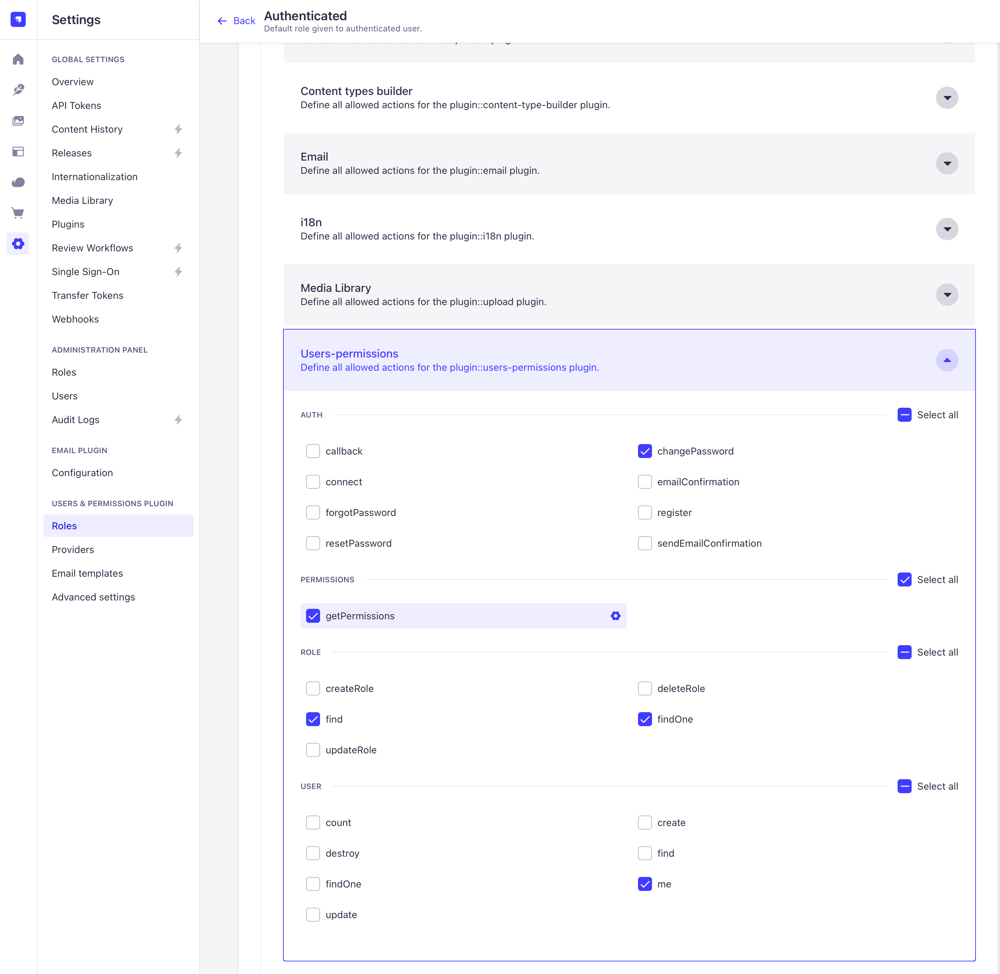

# Базовий проект для інтеграції з Strapi

Базовий проект для інтеграції з [Strapi](https://strapi.io) сервером, може використовуватись як основа для складніших веб додатків, що використовують Strapi.
Містить необхідні налаштування та бібліотеки для роботи з Strapi сервером та відображенням даних на сторінках. Також містить сторінки логіну та реєстрації користувача та мінімальну сторінку для відображення даних зі Strapi.

За звмовчуванням намагається отримати дані з колекції `items`, але може бути легко адаптований для роботи з іншими колекціями.



## Запуск

Необхідно встановити [Node.js](https://nodejs.org/en/download/package-manager) та [Yarn](https://yarnpkg.com/getting-started/install).
Також проект інтегровано з Strapi сервером, який необхідно підняти й налаштувати у .env файлі:

```
API_URL=http://localhost:1337
API_TOKEN='взяти токен з адмінки Strapi'
```

Далі для запуску проекту виконати наступні команди:

```bash
yarn install
yarn start
```

## Підготовка Strapi сервера

Для створення Strapi проекту необхідно виконати наступні команди:

```bash
yarn create strapi-app
```

Далі для запуску Strapi сервера необхідно перейти в папку створеного проекту та виконати:

```bash
yarn develop
```

Сервер Strapi автоматично відкриє панель адміністратора в браузері `http://localhost:1337/admin`, де можна створити користувача та налаштувати колекції даних.

## Технології

Проект використовує мінімальний набір технологій. Серед них:
- [Strapi](https://strapi.io) для зберігання даних
- [express.js](https://expressjs.com) для серверної частини
- [axios](https://axios-http.com/uk/docs/example) HTTP-клієнт
- [Font Awesome](https://fontawesome.com/icons) для іконок
- [Embedded Javascript Templates](https://ejs.co) для рендерингу сторінок
- [Nodemon](https://nodemon.io) для автоматичного перезапуску сервера при зміні файлів проекту

## Структура проекту

 - `/bin` - скрипти для запуску сервера
 - `/public` - статичні файли, такі як стилі, клієнтські скрипти, зображення, шрифти
 - `/src` - код проекту
 - `/routes` - код обслуговування запитів від браузера
   - `/views` - шаблони сторінок
   - `app.js` - головний файл проекту
   - `client.js` - клієнт для роботи з Strapi
   - `utils.js` - функції автентифікації


## Отримання ролей користувачів

За замовчуванням Strapi API не повертає ролі користувача, тому всі користувачі отримують роль "Guest". Щоб мати змогу отримувати ролі користувача необхідно в адмінці Strapi дозволити це робити користувачам з роллю "Authenticated":


